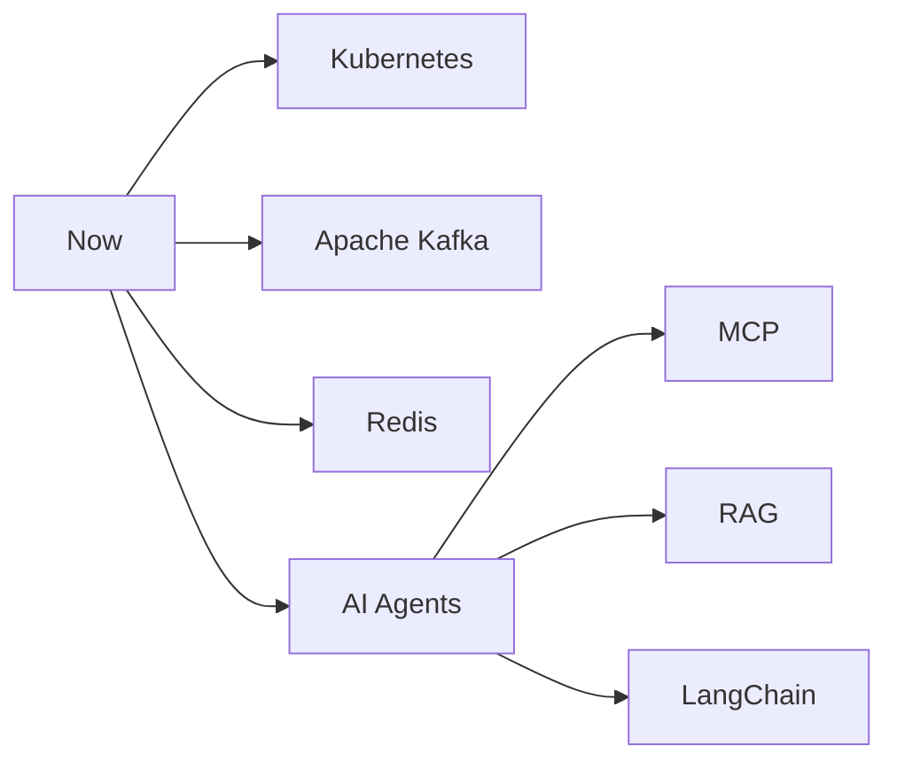

<div align="center">

# 👋 Hi, I'm Dinesh Kumar


<br/>

[](https://portfolio.dntechs.in/home)
[](https://www.linkedin.com/in/dinesh-kumar-92766a318)
[](https://github.com/dineshdeveloper2206)
[](mailto:workdineshnd@gmail.com)


</div>

---

## 👨‍💻 About Me

```text
🧠 Backend Java Developer @ Niiv Software Pvt Ltd
📍 Based in Tamil Nadu, India
⏳ 3+ Years of Professional Experience
🚀 Passionate about scalable systems, clean APIs & AI automation
🌐 Portfolio → https://portfolio.dntechs.in/home
```

I design and build **production-ready backend systems** with Spring Boot, secure APIs, and cloud-ready DevOps workflows — while integrating modern **AI tooling** to accelerate delivery quality.

<details>
<summary><b>📌 Quick Snapshot</b></summary>

<br/>

| | |
|:---|:---|
| **Role** | Backend Java Developer |
| **Company** | Niiv Software Pvt Ltd |
| **Experience** | 3+ Years |
| **Location** | Tamil Nadu, India |
| **Focus** | Backend • AI • DevOps |
| **Email** | workdineshnd@gmail.com |

</details>

---

## 🎯 Current Focus

> Building intelligent automation and reliable backend systems that scale.

- 🤖 **AI-powered GitLab CI/CD** — auto unit tests, SonarQube fixes, coverage boosts & MR creation  
- 🧩 **Spring Boot Microservices** — REST APIs, security, and maintainable architecture  
- 🐳 **Dockerized deployments** — reproducible environments with CI/CD pipelines  
- ⚡ **FastAPI + LLM integrations** — OpenAI-compatible APIs, local & remote inference  

---

## 🛠️ Tech Stack

### Languages


### Frontend


### Databases


---

## ☕ Backend Skills

<div align="center">


</div>

<details>
<summary><b>🔎 Backend Strengths</b></summary>

<br/>

| Area | Capabilities |
|:---|:---|
| **API Design** | RESTful services, clean contracts, versioning-friendly design |
| **Security** | JWT auth, Spring Security, Keycloak integration |
| **Persistence** | JPA / Hibernate, relational modeling, query optimization |
| **Python APIs** | FastAPI & Django for AI-backed and web services |
| **Quality** | Swagger docs, Postman testing, maintainable layered architecture |

</details>

---

## 🤖 AI Skills

<div align="center">


</div>

<details>
<summary><b>🧠 How I Apply AI</b></summary>

<br/>

- Integrate LLMs into backend services via **OpenAI / OpenAI-compatible APIs**
- Run and experiment with local inference using **Ollama** & **vLLM**
- Use **prompt engineering** for reliable automation and code-quality workflows
- Build **AI automation** into CI/CD (tests, Sonar fixes, coverage improvements)
- Explore **agents, MCP, RAG & LangChain** as part of continuous learning

</details>

---

## 🚀 DevOps Skills

<div align="center">


</div>

<details>
<summary><b>⚙️ DevOps Practice</b></summary>

<br/>

| Practice | Tools / Approach |
|:---|:---|
| **Containerization** | Docker & Docker Compose for portable services |
| **CI/CD** | GitLab CI/CD & GitHub Actions pipelines |
| **Reverse Proxy** | Traefik & Nginx for routing and TLS-ready setups |
| **OS** | Linux / Ubuntu server administration |
| **Quality Gates** | SonarQube + JaCoCo integrated into pipelines |

</details>

---

## 🧰 Tools


---

## 🏛️ Architecture Interests

```text
📦 Microservices & Modular Monoliths
🔐 AuthN / AuthZ with JWT & Keycloak
📡 Event-driven thinking (Kafka learning path)
🗄️ Relational + Search-backed data design
🔁 CI/CD as a product quality system
🧠 AI-assisted engineering workflows
```

| Theme | Why it matters |
|:---|:---|
| **API-first backends** | Clear contracts for frontend & integrations |
| **Secure by design** | Auth, token flows, and least-privilege access |
| **Observable delivery** | Pipelines that enforce tests, coverage & Sonar quality |
| **AI in the loop** | Faster fixes, better tests, smarter automation |

---

## 🌟 Featured Projects

### 1️⃣ AI-powered GitLab CI/CD Automation
> AI that writes tests, fixes Sonar issues, improves coverage, and opens Merge Requests.


**Highlights**
- Auto-generates **unit tests**
- Detects & fixes **SonarQube** findings
- Improves **JaCoCo** coverage
- Creates **Merge Requests** automatically

---

### 2️⃣ Portfolio Website
> Personal portfolio showcasing work, skills, and contact — hosted on a VPS.


🔗 [Visit Portfolio](https://portfolio.dntechs.in/home)

---

### 3️⃣ REST API Development — Spring Boot Microservices
> Production-oriented REST services with Spring Boot, security, and clean layering.


---

### 4️⃣ Dockerized Applications
> Container-first packaging for consistent local, CI, and server environments.


---

### 5️⃣ AI Integration Projects (FastAPI)
> LLM-powered backends using FastAPI and OpenAI-compatible interfaces.


---

## 📊 GitHub Stats

<div align="center">


</div>

---

## 🔥 GitHub Streak

<div align="center">


</div>

---

## 🗣️ Top Languages

<div align="center">


</div>

---

## 📈 Activity Graph

<div align="center">


</div>

---

## 🏆 GitHub Trophies

<div align="center">


</div>

---

## 👀 Profile Views

<div align="center">


</div>

---

## 🐍 Contribution Snake

<div align="center">


</div>

> ⚠️ **Setup note:** Add the [contribution snake workflow](https://github.com/Platane/snk#use-with-github-profile-readme) to this profile repo so the snake SVG generates automatically.

<details>
<summary><b>📄 Suggested workflow file</b> <code>.github/workflows/snake.yml</code></summary>

```yaml
name: Generate Snake

on:
  schedule:
    - cron: "0 0 * * *"
  workflow_dispatch:

jobs:
  generate:
    runs-on: ubuntu-latest
    permissions:
      contents: write
    steps:
      - uses: Platane/snk@v3
        with:
          github_user_name: dineshdeveloper2206
          outputs: |
            dist/github-contribution-grid-snake.svg
            dist/github-contribution-grid-snake-dark.svg?palette=github-dark
      - uses: crazy-max/ghaction-github-pages@v3.1.0
        with:
          target_branch: output
          build_dir: dist
        env:
          GITHUB_TOKEN: ${{ secrets.GITHUB_TOKEN }}
```

</details>

---

## 🗺️ Learning Roadmap



| Track | Topics | Goal |
|:---|:---|:---|
| **Cloud Native** | Kubernetes | Deploy & scale containerized services |
| **Messaging** | Apache Kafka | Event-driven backend patterns |
| **Caching** | Redis | Performance & session/state strategies |
| **AI Systems** | Agents • MCP • RAG • LangChain | Production-ready LLM applications |

---

## ✨ Fun Facts

- ☕ Java is my daily driver — Spring Boot is home base  
- 🤖 I use AI not as a shortcut, but as a **quality multiplier**  
- 🐳 If it runs once, I want it to run the same way in Docker  
- 🧪 Tests + Sonar + coverage gates = shipping with confidence  
- 🌙 Late-night VPS tweaks and CI pipeline polishing are normal  

---

## 💬 Quote of the Day

<div align="center">

### *“Build systems that are secure, observable, and ready to scale — then automate the rest.”*

**— Dinesh Kumar**

</div>

---

## 🌐 Connect With Me

<div align="center">

[](https://portfolio.dntechs.in/home)
[](https://www.linkedin.com/in/dinesh-kumar-92766a318)
[](https://github.com/dineshdeveloper2206)
[](https://www.instagram.com/_.dinesh._official_/)
[](mailto:workdineshnd@gmail.com)

</div>

---

## 💙 Support

If you like my work, feel free to ⭐ my repositories or reach out for collaboration.

[](https://github.com/dineshdeveloper2206)
[](mailto:workdineshnd@gmail.com)

---

<div align="center">


**Thanks for visiting!**  
⭐ From [dineshdeveloper2206](https://github.com/dineshdeveloper2206)

<br/>


</div>
